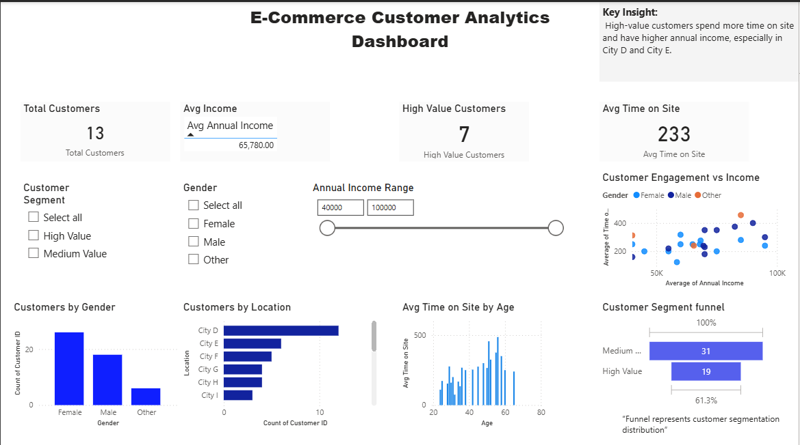

# advanced-ecommerce-dashboard-powerbi
Power BI dashboard analyzing e-commerce customer behavior and segmentation

# 📊 E-Commerce Customer Analytics Dashboard (Power BI)

## 🔍 Project Overview
This project is an interactive **Power BI dashboard** designed to analyze customer behavior for an e-commerce platform.  
It focuses on customer engagement, income patterns, and segmentation to support data-driven decision-making.

---

## 📸 Dashboard Preview

---

## 📌 Key Features
- KPIs: Total Customers, Average Income, Average Time on Site
- Customer Segmentation (High Value vs Medium Value)
- Income vs Engagement Analysis
- Customer Distribution by Gender, Age, and Location
- Interactive slicers for better insights

---

## 🛠 Tools & Technologies
- Power BI
- Power Query
- DAX
- Data Visualization

---

## 📂 Files in Repository
- `E-Commerce-Customer-Analytics.pbix` – Power BI dashboard
- `ecommerce_data.csv` – Sample dataset
- `dashboard_preview.png` – Dashboard screenshot

---

## 📝 Note
This project uses **sample data** for learning and demonstration purposes.
